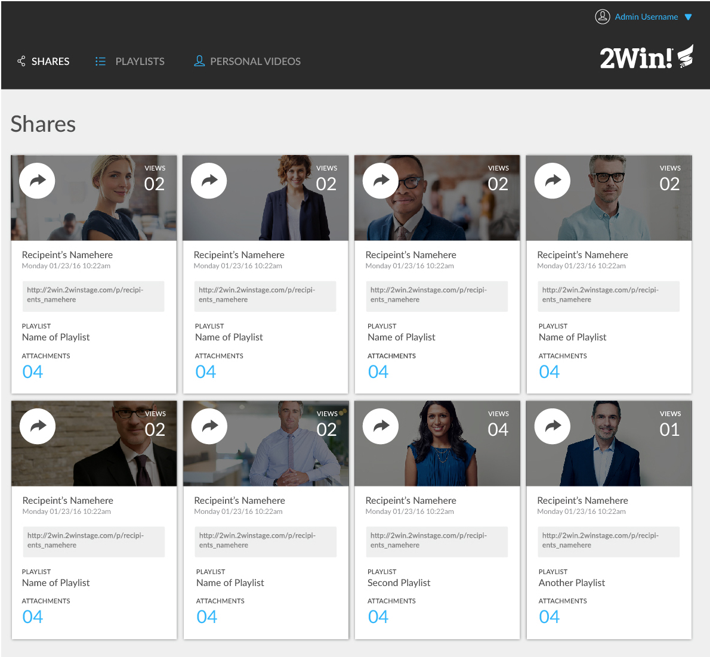

# For this project...

we were asked to create a static site to recreate the layout of a provided comp. We were given creative liberty with theme, copy, icons, images, and color palette.

# The concept behind my version...

is a site/app that allows funds to be raised for activists who have been arrested during direct actions. With no regard for space or time, I selected a variety of iconic images from some of the many social movements in the last 100 years.

# Things I learned:

Pseudo-selectors are handy! In the `header`, I used `::before` and `::after` to set my icons with their `nav` items. Through that process I learned that if I want to see my icon, I better set a `height` and `width` with `content: “”` in order to create a  “pseudo-container” to fill with a `background-image`. Utilizing the `::before` and `::after` pseudo-selectors helped me more efficiently structure the layout and styling the `header`. In addition, using the `background-image` property to add decorate icons to the page is accessibility friendly! 

### Example code:

`.header__nav--top:after,
.header__nav--top:before {
  content: "";
  display: inline-block;
}

.header__nav--top:before {
  background-image: url("./assets/user-icon.png");
  background-size: 1.7rem;
  height: 1.7rem;
  width: 1.7rem;
}

.header__nav--top:after {
  background-image: url("./assets/drop-down-arrow-icon.png");
  background-size: 1rem;
  height: 1rem;
  margin-right: 1rem;
  margin-top: .25rem;
  width: 1rem;
}`

# Remaining uncertainties and areas of improvement: 

Media queries. Although they have become much less mysterious, I now feel they are an art I never rightly appreciated. This site has three layouts for the queries: 4 cards per row, 2 cards per row, and single card column. Still, transitions could be smoother and issues with longer text overflowing containers are present. My way around this was `overflow: hidden`, but I know there must be a better way. 

# Wishlist:

* to solve a responsiveness issue in Firefox that I did not encounter in Chrome or Safari, which is the logo image in the header dropping below the heading when the browser is reduced to about 540px.

* more alt tags in the html for accessibility purposes.

* to add hover state animationsthat would rotate the cards, revealing a quote associated with either the activist or the movement they are/were a part of.

* to tighten up the historical accuracy. For example, I was only able to find the actual set bail amount for a few arrests. The ones that I did, like Rosa Parks, I converted to 2018 dollars.

# My Versions

## Desktop
#### (Two screenshots)

## Tablet

## Mobile

# Original Comp

(Find the project assignment here: http://frontend.turing.io/projects/m1-static-comp-1.html)
